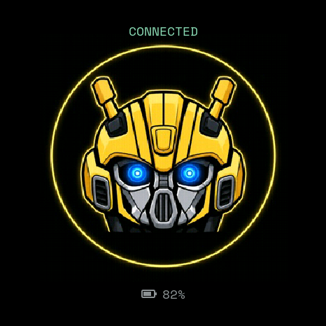
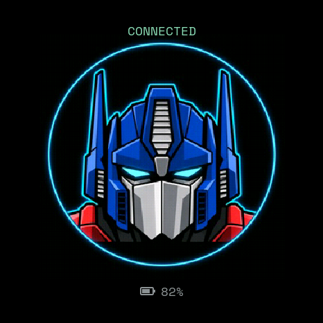
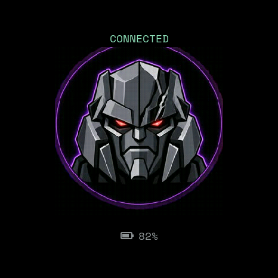
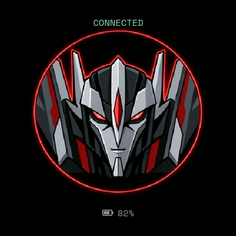
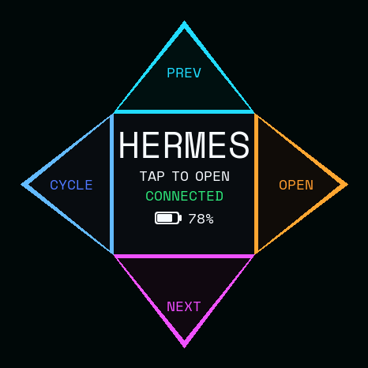
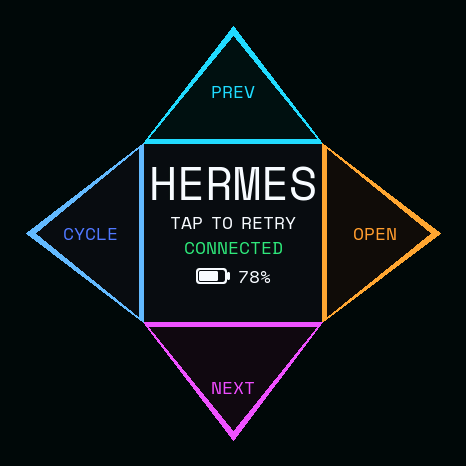

# Stopwatch AgentBezel C152

[简体中文](README.zh-CN.md)

**Stopwatch AgentBezel C152** is an independent, unofficial, open-source
four-screen control surface for the **M5Stack StopWatch Dev Kit C152**:
Codex Micro compatibility, super.engineering project controls, and Hermes
Desktop session controls, plus an interactive robot Home, local quota dashboard
and optional USB microphone.

Codex Micro compatibility is experimental and undocumented. Runtime names,
pairing identities, audio selection and the local Companion identity remain
unchanged. The four-screen experience requires matching source-built USB-mic
firmware and Companion. Validation covers one local setup, not every app version.

## Current version at a glance

Documentation updated **2026-09-22**. Current Companion: **0.1.4 (build 5)**.

- Four screens: robot Home → Codex / ChatGPT → SUPER → HERMES → Home.
- Home: four cinematic robot portraits; silent up/down/right character selection;
  center tap uses one shared talking animation and optional private local speech.
- Latest Home tuning: larger complete portrait rings, centered connection/ring/
  battery with equal clear gaps, and central speech at half its previous PCM
  amplitude (about −6 dB, not a guarantee of half perceived loudness).
- SUPER: previous/next project and next session Tab. Hermes: tap to open or
  restore its window, up/down browse, right opens the selected session.
- Dedicated navigation uses a 350ms cooldown with release gating; cycling and
  central launch retain 800ms protection. Key strokes are paced at 30ms.

The latest [Home acceptance](docs/superpowers/plans/2026-09-21-home-equal-spacing-half-volume.md)
records user-confirmed layout, voice level, character selection and four-screen
controls. Older [navigation/audio acceptance](docs/superpowers/plans/2026-09-12-paced-navigation-verification.md)
is historical evidence, not a claim that every test was rerun for this image.
Public builds contain **no speech samples**; installed private audio is not uploaded.

## Robot Home and three workspaces

**Public builds contain no speech samples.** Home uses silent talking animation
unless you provide authorized local audio via the [speech setup](docs/ROBOT_SPEECH.md).
The lines below describe the privately tested installation, not bundled assets.

The Home workspace uses the existing Companion 0.1.4 and matching USB-mic firmware.
The user has physically verified four-character selection, centered/equally
spaced Home layout, reduced central-speech level and four-workspace controls on
the local C152 installation. This is not a guarantee for other setups; see the
[acceptance record](docs/superpowers/plans/2026-09-21-home-equal-spacing-half-volume.md).
Boot, reconnect and Companion startup select Home without activating a Mac app.
Home stays selected even when the Mac foreground changes. With the local speech
firmware, tap the portrait for “愚蠢的人类，快给我下发任务吧！”. Swipe up for
Optimus Prime, down for Megatron, or right for Starscream; repeat the selected
direction to return to Bumblebee. Character selection is silent, local-only,
non-haptic and sends no Mac input. Every portrait uses the same task voice and
talking animation. The first sleeping-screen touch only wakes the display.
Speech never queues or overlaps. Leaving Home, sleep or power confirmation cancels it.
USB microphone streaming takes priority: an active stream skips speech (silent
animation only), and a new stream preempts playback. No USB speaker endpoint,
microphone recording, network TTS or application content access is added.
See [audio provenance and verification](docs/ROBOT_SPEECH.md). The latest voice
level was accepted on the device; no new microphone recording test was performed
for this layout/volume follow-up.
An awake Home left swipe with a ready Companion link gives the same single
vibration as other workspace swipes; offline left remains silent. This is gesture
feedback, not confirmation of Mac activation.
Status and battery are real device inputs, not the preview's sample values.

<table>
  <tr><th>Bumblebee (default)</th><th>Optimus Prime (up)</th><th>Megatron (down)</th><th>Starscream (right)</th></tr>
  <tr>
    <td width="25%"></td>
    <td width="25%"></td>
    <td width="25%"></td>
    <td width="25%"></td>
  </tr>
</table>

The portraits are original project artwork embedded in firmware as baseline
JPEG assets. They are not film frames, official logos, or network-fetched media.
Leaving Home resets the next visit to Bumblebee.

<table>
  <tr><th>Codex Micro</th><th>super.engineering</th><th>Hermes Desktop</th></tr>
  <tr>
    <td width="33%"></td>
    <td width="33%"></td>
    <td width="33%"></td>
  </tr>
</table>

These are native framebuffer design previews, not hardware photographs.

**Swipe left to cycle: Home → Codex / ChatGPT → SUPER → HERMES → Home.**
The current Codex / ChatGPT entry uses `com.openai.codex`; it is one target,
not two. Left from Home activates Codex; returning Home leaves the Mac unchanged.
Missing or rejected targets are not skipped. The former “return to previous
app” behavior is replaced by this fixed cycle.

| Input | Robot Home | Codex Micro | SUPER | HERMES |
| --- | --- | --- | --- | --- |
| Left physical / right physical | No action¹ | Push to talk / Voice Chat | No action¹ | No action¹ |
| Center tap | Talking animation + optional local voice | Send | No action¹ | Launch/retry when waiting; no action when active |
| Swipe left | Activate Codex | Enter SUPER | Select HERMES waiting page | Enter Home |
| Swipe up | Optimus / back to Bumblebee | Existing app mapping | Previous project | Browse previous session |
| Swipe down | Megatron / back to Bumblebee | Existing app mapping | Next project | Browse next session |
| Swipe right | Starscream / back to Bumblebee | Existing app mapping | Next session Tab | Open owned selection; otherwise no action |
| Power controls | Desk sleep / Travel Mode | Same | Same | Same |

¹ Directional screens and device-side isolation require the explicitly chosen
matching `usb-mic` firmware. The default wireless image remains a Codex panel.
Companion direction handling requires a real `--watch` process.

## Codex Micro workspace

The default dashboard shows Agent state, weekly Codex allowance, reset
countdown, battery and charging/Dock state, and whether Codex, BLE, and quota
sync are healthy. A completed Agent turns green and plays a soft completion
chime. The left physical button is Push to talk, the right button is Voice
Chat, the center dial is Send, and up/down/right remain configurable in ChatGPT Desktop; left is reserved for
workspace cycling while the Companion runs in real watch mode. Physical buttons and touch gestures use
haptics.

The normal center dial uses four balanced rows: connection status, remaining
quota, reset countdown and battery. It omits the redundant `WEEKLY LEFT` label;
diagnostic states retain messages such as `SYNC STALE` and `WAITING CODEX`.

The compatible `Codex Micro` BLE HID channel carries controls. The local quota
companion uses a separate, project-owned BLE GATT service, so the watch never
stores an OpenAI token. The installed ChatGPT Desktop version used during
development exposed one Mic key rather than separate `ACT10` and `ACT11`
assignments: the right button intentionally sends configurable `ACT09`
(`Command Key 4`), not `ACT11`.

On battery, the display dims after two minutes and enters desk sleep after five;
Dock Mode extends those intervals to ten and thirty minutes. Desk sleep keeps
BLE alerts alive. Double-click the red power button for firmware-confirmed
Travel Mode shutdown; power button or USB wakes it. A six-second center hold is
a deliberately slower Travel Mode fallback with a missed-alert warning. Physical
power switching soak testing is still pending, so timings and wake behavior are
experimental until that checklist is complete.

## super.engineering workspace

Use the exact bundle `com.zarifpour.superconductor`. Configure these app
shortcuts: Previous Project = `Control-Option-Up`, Next Project =
`Control-Option-Down`, Next Tab = `Control-Option-Right`.
Up/down/right are sent only to that exact foreground process. Left advances to
Hermes; it does not return to an arbitrary previous app.

## Hermes Desktop workspace

Use **Companion 0.1.4 (build 5)** with matching four-screen USB-mic firmware.
Dedicated SUPER/HERMES events use `host.workspace_navigation`, not Codex's
native radial events; keep Codex up/down/right bindings and verify no background
Codex action. Install/roll back compatible components together. Build/commit
metadata and opt-in diagnostics are described in the [Companion guide](companion/README.md).

Left from SUPER selects **HERMES / TAP TO OPEN** on the watch only; it does not
launch or activate Hermes on the Mac. Tap inside the center square to open the
exact Desktop app. **OPENING** permits one outstanding request; actual Hermes
foreground confirmation enables the existing directions below. Rejection or a
3-second timeout shows **TAP TO RETRY**, with no automatic retry. Up/down/right
are ignored while waiting, opening or retrying; left always exits to Home.
Dock/Command-Tab activation cancels the selection and follows the real app.
Reconnect and Companion restart select Home. Once a work page is selected,
foreground following works as before. All work pages, including Codex, renew
every 5 seconds and fall back to Home after a 15-second lease expires. A Home
acknowledgment is required before stale work-page heartbeats can be accepted.
Mode changes never wake the display. Install and roll back the matched pair;
see the [Home verification record](docs/superpowers/plans/2026-09-15-robot-home-verification.md).

A tap must start and end inside the square, last less than 500ms and never
cross the swipe threshold. It shares the 800ms host cooldown with directions.
The first sleeping-screen tap only wakes; a second tap may open Hermes. Active
Hermes center taps do nothing. Long-hold power controls remain available.

Desktop auto-launch and display heartbeat are separate: the Companion's
5-second HID heartbeat never launches an app. A separately installed
`ai.hermes.desktop` LaunchAgent with `KeepAlive` may repeatedly relaunch the
client after exit. On the approved local setup that job was backed up, unloaded
and disabled, retaining its plist for recovery. Gateway/dashboard were left
unchanged. Do not disable other services or assume this job exists on every Mac.
See [deployment and rollback](companion/README.md#hermes-desktop-launch-policy).

Central launch uses `NSWorkspace.openApplication` even when Hermes is already
running, with activation enabled and new-instance creation disabled. For the
exact foreground Hermes process, Accessibility requests focus on its focused/
main window without reading content, titles or the window list. This addresses
the case where the process was foreground but navigation required a title-bar
click. The user confirmed restored interactions; API success alone is not proof
of a visible/focused window on another installation.

<table><tr><th>Selected</th><th>Request pending</th><th>Retry on tap</th></tr><tr>
<td></td>
<td></td>
<td></td>
</tr></table>

Use the exact native app bundle `com.nousresearch.hermes`, not a CLI, web
dashboard or installer. Up sends `Control-Shift-Tab`, down sends
`Control-Tab`, retaining the [native Desktop browsing shortcuts](https://hermes-agent.nousresearch.com/docs/user-guide/desktop#windows-tabs--panes).
When the central session picker is visible, browse with up/down and swipe right
to open the highlighted session. The Companion retains its own Control press
across up/down gestures; right releases it with no modifier flags. Without an
owned selection, right is a no-op. The tested Hermes 0.17.0 picker commits on
Control release; no Return or Command-T is sent, so right is not New Tab.
Verify the behavior with a physical keyboard on your Hermes version before
installation. Native browsing can depend on the focused Tab region; it is not
project-tree-order navigation. No Hermes plugin or source extension is required.
The Companion does not inspect the picker, read/change Hermes settings or
session data, or retry confirmation. Both the keyboard action and physical
browse/open gestures were confirmed on the tested installation, including
repeat-right and no-picker checks without new sessions, sent drafts or a stuck
Control modifier. Repeat acceptance after changing Hermes versions.

## Shared workspace setup and screen behavior

1. Install the three target desktop apps. Assign each to a normal macOS Space
   manually using **Dock → Options → Assign To → This Desktop** if desired.
   The Companion activates apps and restores focus to Hermes's focused/main
   window; it does not create/enumerate Spaces or choose among window contents.
2. Enable Input Monitoring and Accessibility for the installed
   `CodexWatchCompanion.app`; retain Bluetooth permission for quota sync.
3. Leave **Analog stick left** unbound in ChatGPT's controller settings.
   Preserve the existing up/down/right mappings. Restart the original
   Companion LaunchAgent after any permission change.
4. Install matching Companion and explicitly chosen USB-mic firmware only
   after source validation, backups and exact-port flash confirmation.

SUPER/HERMES share four outward triangles, with no independent center outline.
The battery icon and percentage are centered together beneath the title and
connection status, including unknown and three-digit percentages.
Every accepted local swipe picks four distinct colors from a 12-color pool;
each direction changes from its previous color. Text colors remain stable.
Palette feedback has its own 800ms cooldown; redraw, heartbeat, quota updates
and Dock/Command-Tab changes do not recolor. This is local input feedback, not
proof that the Mac accepted a shortcut.

Except for pinned Home and the explicitly selected Hermes waiting page, the display follows
actual foreground activation, with a 5-second heartbeat
and a 15-second connection-owned lease. Leaving the two directional apps sends
Codex; failed Codex writes get at most two further 5-second retries. Losing the
lease or owner connection restores Home. Foreground updates never wake the
screen. Disabled short taps/physical controls do not wake directional screens;
a genuine swipe wakes without also issuing an unseen action. Center long-hold
and red-button power behavior remain available.

SUPER/HERMES block Agent, Send and ChatGPT microphone/voice button actions;
mode transitions release held controls and suppress stale completion notices.
The USB microphone endpoint remains available. MainActor routing revalidates
the exact foreground PID/bundle before fixed process-targeted key delivery;
no global key injection or application-content reading is used.

### Validation status and checks for your installation

The [latest Home record](docs/superpowers/plans/2026-09-21-home-equal-spacing-half-volume.md)
covers the user-observed final layout, lower central voice, character selection
and four-screen controls. The [paced-navigation record](docs/superpowers/plans/2026-09-12-paced-navigation-verification.md)
covers earlier navigation, background-window restoration and microphone checks;
the [original three-workspace record](docs/superpowers/plans/2026-09-04-hermes-open-physical-acceptance.md)
remains historical. Do not interpret them as a complete rerun on every later image.
The latest follow-up did not repeat microphone recording or long-duration soak tests.
Full XCTest remains unavailable on the development host because its Command
Line Tools lack XCTest; the Swift harness is not a complete XCTest run.

For each new installation, verify one full left-swipe cycle, cold app launch, failure/no-skip, assigned
Spaces, all app-specific directions, 350ms navigation/800ms cycle-launch gating, random colors, sleep/wake,
input isolation, no background ChatGPT actions, 15-second fallback, reconnect,
USB microphone capture, quota updates and original automatic startup.
Builds and native previews alone do not establish C152 hardware success.

## Recommended installation

This is a source-build project: no prebuilt macOS app, DMG, or PKG is
distributed. The recommended path is to open this repository locally in Codex
on the Bluetooth-capable Mac that will pair with the C152. It requires macOS
14+, Swift 5.10+ (Xcode 15.3 Command Line Tools+), PlatformIO Core, a
data-capable USB-C cable for the first flash, and a signed-in ChatGPT Desktop
with Codex Micro support. This port supports **M5Stack StopWatch Dev Kit, SKU
C152** only; other M5Stack devices are unsupported.

Choose the intended experience before building:

| Experience | Firmware | What you get |
| --- | --- | --- |
| Four-screen AgentBezel described above | Explicitly choose `pio run -d usb-mic` + Companion 0.1.4 | Robot Home, Codex, SUPER, HERMES, input-only USB microphone; local voice optional |
| Basic Codex-only compatibility | `pio run -e m5stack-stopwatch` | Codex dashboard and BLE controls, Mac-selected microphone; no four-screen Home/selector |

The following prompt **explicitly selects the four-screen USB-mic variant**.
For Codex-only installation, use the basic target in the manual section instead;
do not mix the two variants' startup checks. Connect the C152, never guess its
serial port, and paste this into Codex:

```text
Install the four-screen AgentBezel experience on my M5Stack StopWatch Dev Kit C152.
I choose the isolated USB-mic firmware and matching Companion, including Home,
Codex, SUPER and HERMES. Voice samples are not included in the public repository.

Read AGENTS.md and README.md completely before acting. Work through the setup
autonomously, but follow these safety rules:

1. Start with read-only checks. Confirm macOS, the C152 target, available build
   tools, and the exact newly connected serial device.
2. Build the selected USB-mic variant with `pio run -d usb-mic`. Explain its
   dependency downloads and disk cost; do not enable unrelated audio experiments.
3. Explain any missing dependency before installing it. Never ask me for an
   OpenAI API key, login cookie, access token, or other credential.
4. Show me the official M5Stack factory-recovery link and build the firmware
   before attempting an upload.
5. Immediately before flashing, report the exact /dev/cu.* port you resolved
   and ask me to confirm that one destructive device action.
6. After flashing and restarting the watch, verify Codex StopWatch Mic USB input
   and BLE/HID independently. This variant has no normal serial READY console.
7. Help me grant ChatGPT Input Monitoring and configure ChatGPT Desktop: left
   button = Push to talk, Command Key 4 = Toggle voice chat, center = Send, and
   keep up/down/right configurable and leave left unbound for watch-mode cycling.
8. Build the Swift quota companion from source. Use demo discovery to find this
   Mac's CoreBluetooth UUID, then bind real quota writes to that exact device.
9. If I approve automatic startup, create the local app wrapper and LaunchAgent
   only on this Mac. Keep generated paths, UUIDs, logs, and app files out of Git.
10. Guide me through Companion Input Monitoring/Accessibility, SUPER shortcuts
    and optional manual Space assignment. Do not silently change permissions or
    app settings. Keep any existing LaunchAgent configuration and private binding.
11. Verify four-screen cycling, character selection, Hermes central launch and
    navigation, SUPER controls, Codex controls, input isolation, sleep/reconnect,
    quota and a short local microphone recording. Delete that recording afterward.
12. Keep public builds silent unless I supply authorized local audio. Never upload
    private speech. Record only physically observed results as passed, and preserve
    matched firmware/Companion backups before replacement.
```

The repository's [AGENTS.md](AGENTS.md) provides durable installation and
privacy boundaries. Claude Code and other local coding agents can follow the
same instructions, but Codex is the documented default.

## macOS permissions and app configuration

Codex handles terminal work; the user still approves missing tools and the
exact flash, pairs **Codex Micro** in **System Settings > Bluetooth**, and
allows **ChatGPT** in **System Settings > Privacy & Security > Input
Monitoring** before quitting and reopening ChatGPT. Configure the actions in
**ChatGPT Desktop > Settings > Codex Micro**. The base installation needs
Bluetooth access for the locally built companion; the optional
SUPER/HERMES phase additionally needs Input Monitoring and Accessibility
for `CodexWatchCompanion.app`.

Build the quota companion from source, run demo discovery, and bind real writes
only to the CoreBluetooth UUID printed by that Mac. Keep the `--watch` process
running unless automatic startup is installed. With approval, a locally built
wrapper and per-user LaunchAgent can provide automatic startup; generated app
files, paths, UUIDs, and logs remain local. The LaunchAgent template identity is
`io.github.codex-micro-stopwatch.companion` and the executable remains
`codex-watch-companion`.

After an image change, verify BLE connectivity and HID enumeration separately;
a Bluetooth connection alone does not prove that controls are attached. Only
re-pair the StopWatch if troubleshooting establishes a stale pairing problem;
do not repeatedly delete working pairings or reset system permissions. Keep a
real Codex Micro's pairing record, but disconnect or power it off while
validating this port: one active Micro is supported at a time.

## Optional USB microphone

The default `m5stack-stopwatch` image uses the Mac microphone. Users who
explicitly choose the isolated `usb-mic` build can expose the StopWatch as
**Codex StopWatch Mic**: 48 kHz, 16-bit, mono, input-only USB Audio. It has no
USB speaker/output endpoint. BLE controls and the dashboard remain included;
the local completion chime plays only while the Mac is not streaming microphone
audio. Keep USB connected while recording, select **Codex StopWatch Mic** in
**System Settings > Sound > Input**, and keep Push to talk and Voice Chat
actions on Bluetooth while audio samples travel over USB.

Build this separate target with `pio run -d usb-mic`; explain its first-build
toolchain download, time, and disk cost before starting. Follow the same
factory-recovery and exact-port confirmation rules. Afterward, do not expect
the default serial READY marker: verify the selected **Codex StopWatch Mic**
input, verify BLE/HID separately, and make a short local recording test. Do
not commit recordings, device identifiers, or local paths.

## Privacy and architecture

The Swift `CodexWatchCompanion` starts a local Codex App Server with the
user's existing signed-in context and reads `account/rateLimits/read`. It sends
only remaining percentage and reset countdown over the project-owned quota
GATT service to the explicitly bound watch. The compatible HID interface does
not include account rate limits.

In a real `--watch` run, the optional workspace integration additionally sends
only fixed `home`/`codex`/`super`/`hermes` display modes and optional Hermes
`idle`/`opening`/`error` state over
vendor HID Report ID 6; the watch's center action is the fixed `open_hermes` enum.
Dedicated directions carry only fixed workspace/direction/phase enums on that
same HID transport, not project or session data.
It does not send API keys, tokens, account identifiers, prompts, task text,
audio, project/session/window/Space metadata, or user content. It does not
scrape UI, use a cloud relay, inspect keyboard text, invoke shell commands or
AppleScript, use private Space APIs, or inspect super.engineering or Hermes settings.
Hermes central launch has one narrow Accessibility exception: focused/main
window handles and focus state are used locally to raise/focus the exact process's
window. No window title, content or window list is read or sent to the watch.

Device MAC addresses, CoreBluetooth UUIDs, usernames, home-directory paths,
and logs are local installation data and must never be committed. BLE pairing
uses the platform's Just Works flow without passkey authentication: use the
project in a trusted environment and remove stale pairings when a Mac or watch
changes owner. See [the companion documentation](companion/README.md) and the
[GATT contract](docs/COMPANION_PROTOCOL.md).

## Manual build and flash

The Codex-assisted flow is recommended. Maintainers can use
[PlatformIO Core](https://docs.platformio.org/en/latest/core/index.html):

```sh
pio run -e m5stack-stopwatch
pio device list
```

Identify the exact serial device that appeared for the connected C152. Build
first, read M5Stack's [official StopWatch factory-recovery guide](https://docs.m5stack.com/en/guide/restore_factory/stopwatch),
and only then flash the resolved port after explicit confirmation:

```sh
pio run -e m5stack-stopwatch --target upload --upload-port /dev/cu.YOUR_C152_PORT
```

Never copy a port from another user's documentation. A successful default boot
prints `CODEX_MICRO_STOPWATCH_READY`; verify it against that same port:

```sh
python3 scripts/serial_probe.py /dev/cu.YOUR_C152_PORT --seconds 30 \
  --expect CODEX_MICRO_STOPWATCH_READY
```

For the optional USB-mic image, use the same recovery and exact-port safeguards:

```sh
pio run -d usb-mic
pio run -d usb-mic -e m5stack-stopwatch-usb-mic --target upload \
  --upload-port /dev/cu.YOUR_C152_PORT
```

The USB-mic image replaces normal USB serial with audio, so no
`CODEX_MICRO_STOPWATCH_READY` is expected. Later updates can use the
companion's encrypted `--enter-bootloader` command, then must rediscover and
confirm the newly enumerated port; M5Stack's manual recovery gesture remains
the fallback.

To run the quota companion manually:

```sh
cd companion
swift build -c release

# Demo data only; prints the UUID seen by this Mac.
.build/release/codex-watch-companion --demo --verbose

# Replace the placeholder locally. Never commit the resulting UUID.
.build/release/codex-watch-companion \
  --device-id YOUR_COREBLUETOOTH_UUID --watch --interval 60
```

## Troubleshooting

### The C152 does not appear as a serial device

- Try a known data-capable USB-C cable and another port.
- Disconnect other development boards, list ports again, and reconnect only the
  C152.
- If installed firmware cannot boot, follow M5Stack's official download-mode
  and factory-recovery instructions.

### Codex Micro does not appear in Bluetooth settings

- Restart the watch and scan again.
- If a stale pairing is confirmed, re-pair only this StopWatch; avoid repeated
  pairing resets without checking the BLE and HID layers first.
- For the default image, confirm `CODEX_MICRO_STOPWATCH_READY` over serial. For
  USB-mic, verify its audio interface and BLE/HID independently.

### ChatGPT sees the Micro but controls do nothing

- Allow ChatGPT in Input Monitoring, then quit and reopen it.
- Disconnect any other active Codex Micro.
- Temporarily quit keyboard remappers or security tools that may claim or block
  HID, then reconnect.

### The right button does not open Voice Chat

Assign **Command Key 4** to **Toggle voice chat** in ChatGPT Desktop. The
button sends `ACT09`, not `ACT11`.

### The screen says `SYNCING MAC` or quota is stale

- Confirm the companion runs on the paired Mac.
- Re-run demo discovery and bind the exact UUID printed on that Mac.
- Do not copy a UUID from another computer: CoreBluetooth identifiers are local
  to the host.

### Optional workspace navigation does not work

- Confirm the foreground bundle is `com.zarifpour.superconductor` or
  `com.nousresearch.hermes`, the corresponding
  fixed shortcuts work from the physical keyboard, and Accessibility is enabled
  for `CodexWatchCompanion.app`.
- Input Monitoring is required to receive radial gestures. If Accessibility is
  missing, only project/tab navigation is disabled; left cycling, quota,
  and USB microphone input remain available.
- For Hermes, enter its waiting page, tap the center and wait for the operating
  page. Down/down/up should move selection; right releases it to open. Right
  without a selection owned by the Companion deliberately does nothing.
- If physical Control-Tab also fails until clicking the title bar, check window
  focus and the installed Companion 0.1.4 identity/permissions. Do not treat app
  foreground status as proof of window focus or replace delivery with global keys.

## Acknowledgements, license, and trademarks

This repository belongs to an open-source implementation lineage:

1. [`imliubo/codex-micro-4-core2`](https://github.com/imliubo/codex-micro-4-core2)
   established an earlier Codex Micro compatibility implementation for M5Stack
   Core2 and is the implementation reference for portions of the BLE vendor-HID
   compatibility layer.
2. [`digitsisyph/codex-micro-stopwatch`](https://github.com/digitsisyph/codex-micro-stopwatch)
   adapts portions of that BLE layer for the M5Stack StopWatch C152, then adds
   the StopWatch UI, power behavior, quota companion, and optional USB
   microphone. It is the direct codebase on which this repository builds.
3. **Stopwatch AgentBezel C152** continues the StopWatch codebase with Codex Micro,
   super.engineering and Hermes Desktop workspaces, including foreground
   Companion integration and dedicated directional displays, plus four-character
   robot Home, local speech support and USB microphone priority handling.

This is an implementation lineage, not a claim that the repositories are
runtime package dependencies or officially affiliated projects. Each later
step depends on, cites, and extends earlier open-source work. Please preserve the
original notices when redistributing, describe your own changes clearly, cite
the project you build upon, contribute generally useful fixes upstream where
appropriate, and treat maintainers and contributors with respect. Healthy open
source is shared stewardship: we maintain compatibility and the commons
together.

The adapted code and this project's changes are distributed under the MIT
License with applicable attribution preserved in [LICENSE](LICENSE) and
[NOTICE.md](NOTICE.md). Space Mono remains under the SIL Open Font License 1.1
in `assets/fonts/OFL.txt`.

OpenAI documentation for the original device is available at
[Codex Micro](https://learn.chatgpt.com/docs/features/codex-micro), and the
local client interface used by the companion is documented under
[Codex App Server](https://learn.chatgpt.com/docs/app-server).

Names and marks are used only to identify compatibility. See [NOTICE.md](NOTICE.md)
for attribution, protocol, security, warranty, and trademark notices.
